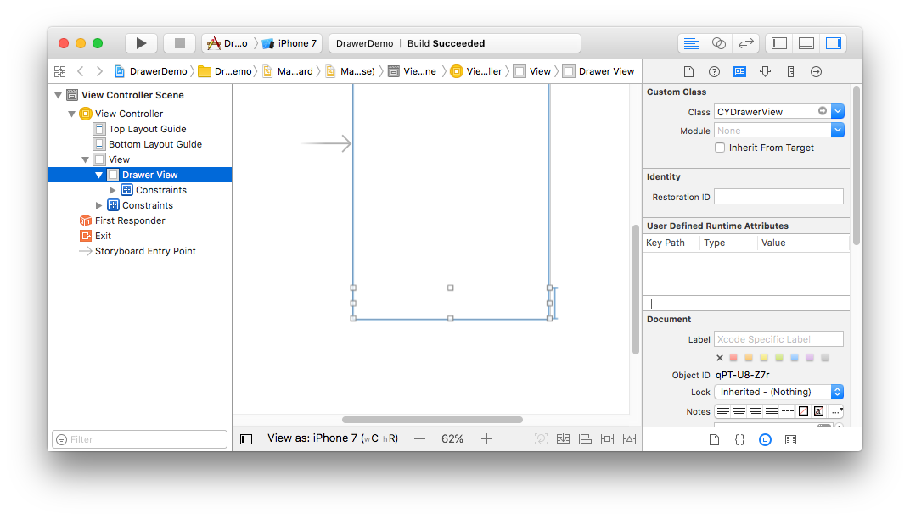

# CYDrawerView

A collapsing table view for presenting a list of options to choose from.


## Overview

Tap or drag the drawer handle (the gray area) to open and close.  When closed, the list moves below the bottom edge of the screen so that only the handle is visible.

## Usage

Add `CYDrawerView.h` and `CYDrawerView.m` to your target.  You'll need a bridging header for a Swift project.

Then, add a drawer view instance to your view controller, either programmatically or using Interface Builder. 

### Using Interface Builder

To add the widget to a storyboard or `.xib` file, add a `UIView` at the bottom of your view controller.  Position the view using Auto Layout so that it hugs the bottom of its superview.  Then, select the view, open the Identity Inspector tab in Xcode's right sidebar, and set the class type to `CYDrawerView`.



There's an example of this at `DrawerDemo/DrawerDemo.xcodeproj`.

### Programmatically

To add a `CYDrawerView` programmatically, add the following to your view controller's `viewDidLoad()` method.

```
let drawerView = CYDrawerView.init()
drawerView.dataSource = self
drawerView.delegate = self
drawerView.translatesAutoresizingMaskIntoConstraints = false

self.view.addSubview(drawerView)

// Add layout constraints
self.view.addConstraints(NSLayoutConstraint.constraints(
    withVisualFormat: "H:|-0-[drawerView]-0-|",
    options: [],
    metrics: nil,
    views: ["drawerView": drawerView]))
self.view.addConstraints(NSLayoutConstraint.constraints(
    withVisualFormat: "V:[drawerView(60)]-|",
    options: [],
    metrics: nil,
    views: ["drawerView": drawerView]))
```

## Requirements

* Xcode 8
* iOS 8.0 and above
